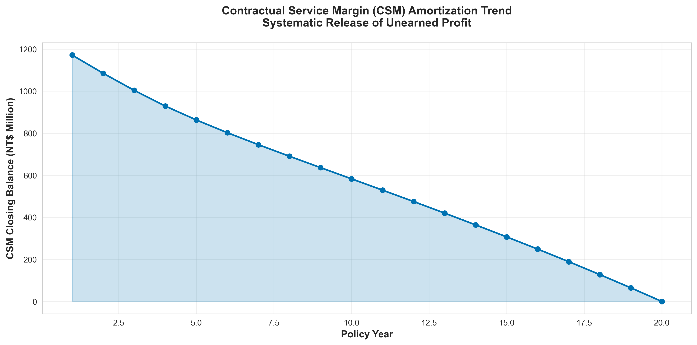
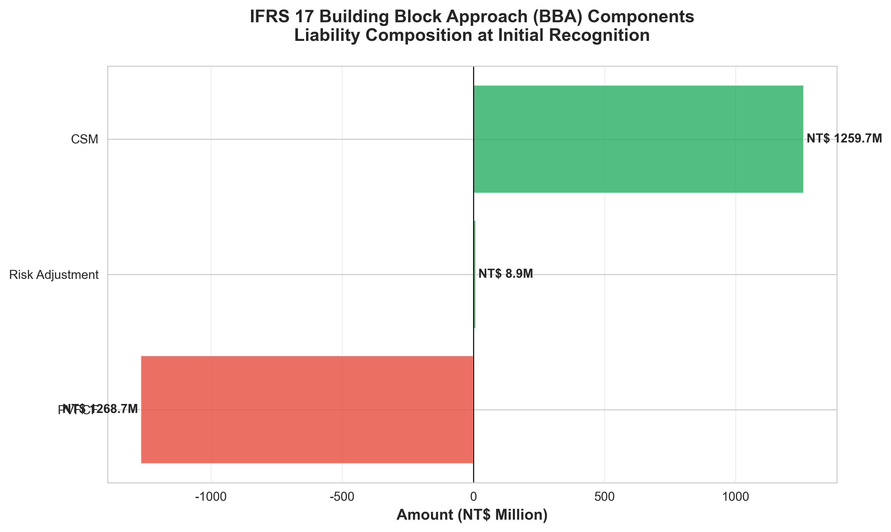
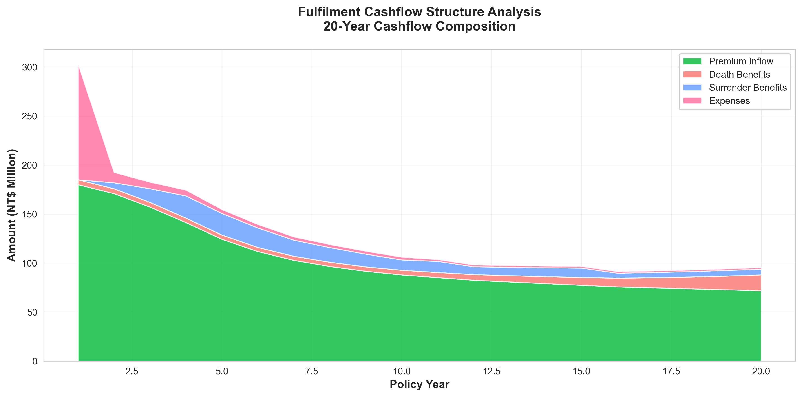
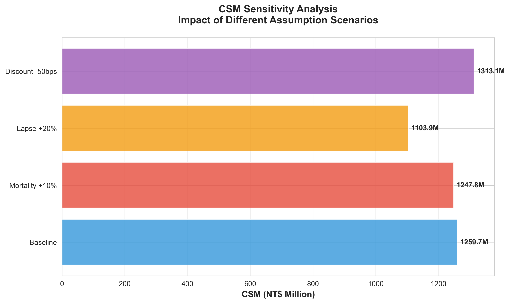

# IFRS 17 合約服務邊際 (CSM) 計算模型

<div align="center">


</div>

---

## 📋 專案簡介

實現 **IFRS 17 國際財務報導準則第 17 號「保險合約」** 中的核心概念 — **合約服務邊際 (CSM)**。提供完整的負債衡量框架，同時支援 **TW-ICS (Taiwan Insurance Capital Standards)** 資本適足性評估。

### 🎯 核心目標

- ✅ 完整實現 IFRS 17 BBA 計算邏輯
- ✅ 模組化設計，易於維護和擴展
- ✅ 支援敏感性分析與情境測試
- ✅ 專業視覺化圖表生成
- ✅ 可審計的程式碼結構
- ✅ 雙語實現 (R & Python)

---

## 🌟 特點

### 核心功能模組

| 模組 | 功能 | 描述 |
|------|------|------|
| **1. 現金流量預測** | `project_cashflows()` | 逐年預測保費流入、理賠/脫退給付流出、費用支出 |
| **2. 折現因子計算** | `calculate_discount_factors()` | 基於即期利率曲線計算各期折現因子 |
| **3. 風險調整** | `determine_risk_adjustment()` | 使用資本成本法計算非金融風險調整 (99.5% VaR) |
| **4. BBA 組件計算** | `calculate_BBA_components()` | 整合計算 PVFCF、RA、CSM 與 LRC |
| **5. CSM 攤銷** | `amortize_csm()` | 計算 CSM 在保障期間內的系統性釋放 |
| **6. 敏感性分析** | `run_scenario()` | 多情境假設變動影響分析 |


---

## 🚀 快速開始

### Python 版本

#### 環境需求

```bash
Python >= 3.8
numpy >= 1.20
pandas >= 1.3
matplotlib >= 3.4
seaborn >= 0.11
```

#### 安裝與執行

```bash
# 1. Clone 專案
git clone https://github.com/yourusername/ifrs17-csm-model.git
cd ifrs17-csm-model

# 2. 安裝依賴
pip install -r requirements.txt

# 3. 執行範例
python ifrs17_csm_model.py

# 4. 查看結果
ls output/
# - csm_amortization_trend.png
# - cashflow_structure.png
# - bba_components.png
# - csm_sensitivity_analysis.png
```

### R 版本

#### 環境需求

```r
R >= 4.0
dplyr >= 1.0
ggplot2 >= 3.3
tidyr >= 1.1
knitr >= 1.3
scales >= 1.1
```

#### 安裝與執行

```R
# 1. 設定工作目錄
setwd("path/to/ifrs17-csm-model")

# 2. 安裝套件
install.packages(c("dplyr", "ggplot2", "tidyr", "knitr", "scales"))

# 3. 執行範例
source("R/run_example.R")

# 4. 查看結果
list.files("output/")
```

---

## 📊 範例輸出

### 計算結果摘要

```
======================================================================
IFRS 17 建築區塊法 (BBA) 計算結果摘要
======================================================================
履行現金流量現值 (PVFCF): NT$ -1,268.7M
風險調整 (RA):            NT$ 8.9M
合約服務邊際 (CSM):       NT$ 1,259.7M
剩餘保障負債 (LRC):       NT$ 0.0M
======================================================================
```

### CSM 攤銷時間表（前 5 年）

| 年度 | 期初CSM (M) | 利息增值 (M) | 釋放至損益 (M) | 期末CSM (M) |
|------|-------------|--------------|----------------|-------------|
| 1 | 1,259.7 | 25.2 | 113.4 | 1,171.5 |
| 2 | 1,171.5 | 23.4 | 109.9 | 1,085.0 |
| 3 | 1,085.0 | 21.7 | 103.1 | 1,003.7 |
| 4 | 1,003.7 | 20.1 | 94.6 | 929.2 |
| 5 | 929.2 | 18.6 | 84.8 | 862.9 |

### 敏感性分析結果

| 情境 | PVFCF (M) | RA (M) | CSM (M) | CSM變動% |
|------|-----------|--------|---------|----------|
| 基準情境 | -1,268.7 | 8.9 | 1,259.7 | 0.0% |
| 死亡率 +10% | -1,257.1 | 9.3 | 1,247.8 | -0.9% |
| 脫退率 +20% | -1,112.5 | 8.5 | 1,103.9 | -12.4% |
| 折現率 -50bps | -1,322.6 | 9.5 | 1,313.1 | +4.2% |

### 視覺化圖表

<div align="center">
  
  
  
  
</div>

---

## 🏗️ 專案架構

```
ifrs17-csm-model/
│
├── ifrs17_csm_model.R        # R實現（主程式）
│
├── ifrs17_csm_model.py            # Python 實現（主程式）
│
├── output/                         # 輸出結果
│   ├── csm_amortization_trend.png
│   ├── cashflow_structure.png
│   ├── bba_components.png
│   └── csm_sensitivity_analysis.png
│
├── data/                          # 數據輸入（可選）
│   └── assumptions_template.xlsx
│
├── README.md                      # 專案說明文件
```

---

## 📖 方法論

### IFRS 17 建築區塊法 (BBA)

BBA 將保險負債分解為三個核心組件：

1. **履行現金流量現值 (PVFCF)**
   - 對未來所有現金流量的無偏誤、機率加權估計
   - 使用市場一致的折現率折現至現值
   
2. **非金融風險調整 (RA)**
   - 量化承擔非金融風險（死亡、脫退、費用等）的補償
   - 本模型採用**資本成本法**，符合 99.5% VaR 標準
   
3. **合約服務邊際 (CSM)**
   - 代表合約初始日的未賺得利潤
   - 在保障期間內系統性攤銷並釋放至損益
   - 計算公式：CSM = -(PVFCF + RA)（盈利性合約）

### IFRS 17 與 TW-ICS 整合

```
┌─────────────────────────────────────────┐
│   精算假設與保單資料庫                  │
│   (死亡率, 脫退率, 費用率等)            │
└────────────────┬────────────────────────┘
                 │
                 ▼
┌─────────────────────────────────────────┐
│   IFRS 17 BBA 模型                      │
│   ├── project_cashflows()               │
│   ├── calculate_discount_factors()      │
│   ├── determine_risk_adjustment()       │
│   └── calculate_BBA_components()        │
└────────┬────────────────────────┬───────┘
         │                        │
         ▼                        ▼
┌──────────────────┐    ┌─────────────────────┐
│ IFRS 17 財務報表 │    │ TW-ICS 資本適足性   │
│ ├── LRC          │    │ ├── 技術準備金      │
│ ├── P&L          │    │ ├── SCR             │
│ └── OCI          │    │ └── Own Funds       │
└──────────────────┘    └─────────────────────┘
```

---

## 💼 實務應用

### 適用場景

- ✅ **財務報表編製**: IFRS 17 季度/年度報告
- ✅ **資本管理**: TW-ICS 清償能力評估
- ✅ **產品開發**: 新產品盈利能力分析
- ✅ **ALM 策略**: 資產負債管理優化
- ✅ **監管申報**: 符合金管會要求
- ✅ **風險管理**: 壓力測試與情境分析

### 實務案例

**情境**: 評估利率風險對 CSM 的影響

```python
# 建立模型
model = IFRS17_CSM_Model(policy_data, assumptions, proj_years=20)

# 基準情境
baseline = model.calculate_BBA_components()

# 利率下降 100 bps
stress_assumptions = assumptions.copy()
stress_assumptions['discount_curve'] = [r - 0.01 for r in assumptions['discount_curve']]
stress_model = IFRS17_CSM_Model(policy_data, stress_assumptions, proj_years=20)
stress_results = stress_model.calculate_BBA_components()

# 分析影響
csm_impact = (stress_results['CSM'] - baseline['CSM']) / baseline['CSM']
print(f"CSM 變動: {csm_impact:.2%}")
```

---

## 📚 延伸閱讀

### IFRS 17 官方資源

- [IFRS 17 準則全文](https://www.ifrs.org/issued-standards/list-of-standards/ifrs-17-insurance-contracts/)
- [IASB 實施指引](https://www.ifrs.org/projects/completed-projects/2017/ifrs-17-insurance-contracts/)

### 監管指引

- [金管會 IFRS 17 專區](https://www.fsc.gov.tw/)
- [TW-ICS 制度說明](https://www.lia-roc.org.tw/)

### 學術文獻

- IFRS 17 Technical Summary (IASB)
- Risk Adjustment under IFRS 17 (IAA)
- Contractual Service Margin Allocation (EFRAG)


</div>
